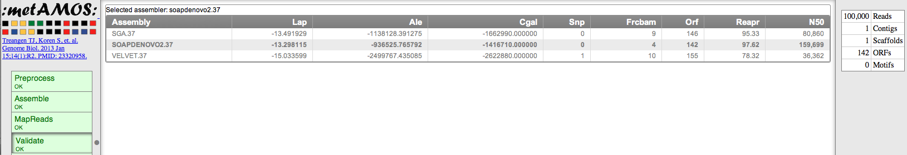
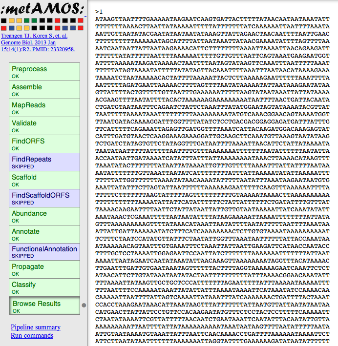

############
TweetAssembler v0.1b
############

Introduction
===============

TweetAssembler is a twitter-based interface to an isolate genome assembly server powered by iMetAMOS:

     Automated ensemble assembly and validation of microbial genomes.
     Sergey Koren, Todd J Treangen, Christopher M Hill, Mihai Pop, Adam M Phillippy
     bioRxiv doi: 10.1101/002469
     http://biorxiv.org/content/early/2014/02/07/002469

Why Twitter?
==============

- Good question! The main Raison d'être of TweetAssembler is to highlight the utility of iMetAMOS; just point it to your reads (no other params required!) and it will preprocess, tune, assemble, validate and create an HTML report of the results. This enables the submit command to be readily constructed in fewer than 140 chars. 

Limitations
===============

Before proceeding, its important to higlight a few important points:

- The server behind TweetAssembler is only able to assemble a couple of requests (at best) per day. Specs are: 32GB RAM & 32GhZ of compute. 
- There exists limitations on the size of the input data. i.e. MiSeq ok, HiSeq not ok. be gentle!
- TweetAssembler is nothing more than a tweet-based interface to an iMetAMOS webserver.
- Given the limited resources, job queue management is disabled. You will only be able to run a job if no other jobs are active; your only indication that your job was accepted is the confirmation tweet (see below). 
- Twitter has a maximum # of tweets allowed per day (1000), as well hourly limits. If TweetAssembler goes over any of these limits it will be deactivated for approx. 1 hour, potentially longer.

Quick Start
===============

1) First, issue a request to follow @imetamos:

2) Next, contact the developers to get your twitter account added to the `allowed accounts` list:

- Todd J Treangen (treangen@gmail.com)
- Sergey Koren (sergek@gmail.com)

3) Once approved, compose a tweet to @imetamos using the following syntax:

.. code-block:: bash

    @imetamos [fastq_pair_1] [fastq_pair_2] [#ASSEMBLE] [id]

- Think of an automated #icanhazpdf but for genome assemblies (#icanhazasm). 
- Currently reads need to be in non-interleaved fastq format.
- id simply needs to be a job-unique integer to avoid duplicate tweets in case you have to submit your job multiple times before it runs. 
- You should notice that no parameters are required (except for the input data). In practice this works thanks to several software packages, e.g. kmergenie (http://kmergenie.bx.psu.edu/), and an ensemble assembly approach (powered by several assembly and assembly validation tools). 

4) You should immediately receive a response tweet similar to:

5) Then simply wait for the confirmation tweet that the job was successful. 

6) Upon completion, you will be able to view the HTML report :

7) and download your assembly:

8) Suggestions & comments welcome! 